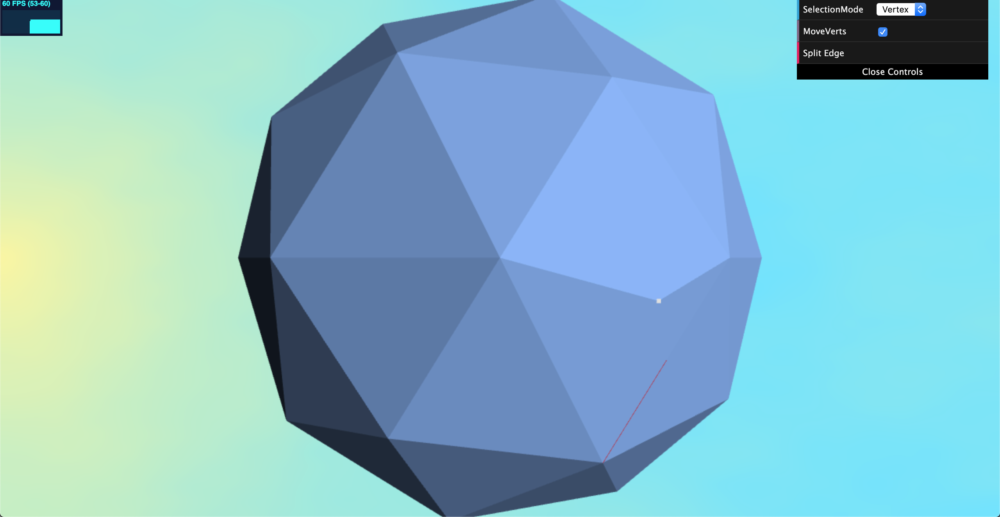
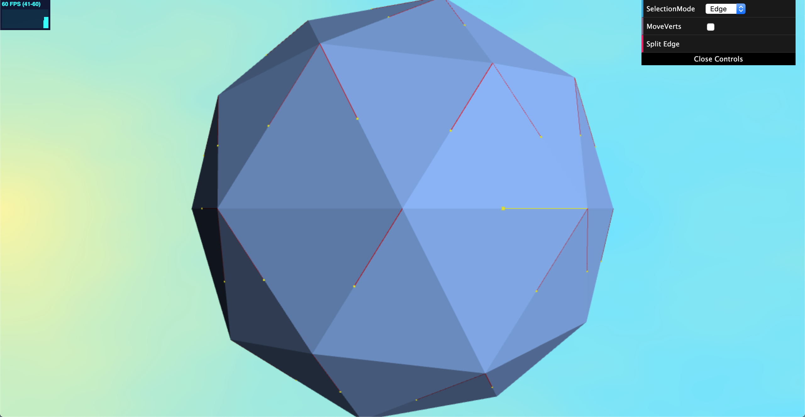
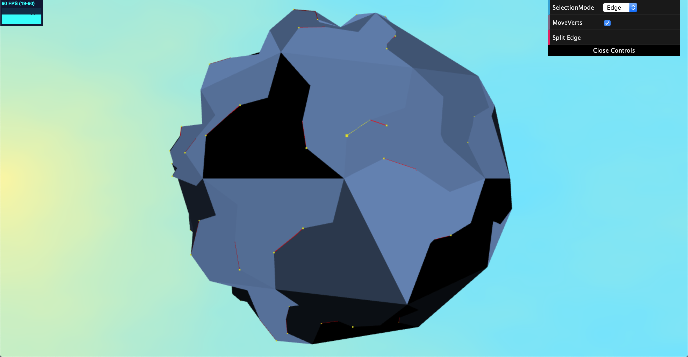
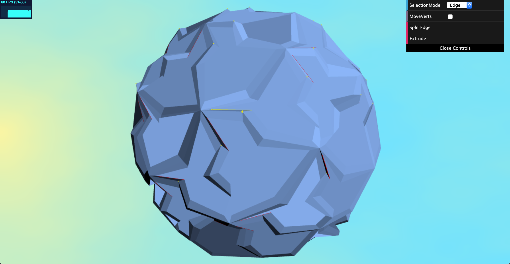

# Escher Sphere Construction Kit
Name: Crystal Lee

PennKey: leecr

Email: leecr@seas.upenn.edu

[Website](www.crystaljlee.com)

## Live Project Demo
[Link](https://leecr97.github.io/escher-sphere/)

## Project Description
This project is an implementation of the paper "Escher Sphere Construction Kit" by Jane Yen and Carlo Séquin.

The term "Escher Spheres" is used to describe spherically symmetric sculptures created by the 20th century modern artist M.C. Escher. This project, the Escher Sphere Construction Kit, is a computer-aided design program that allows the user to create their own Escher Spheres by creating spherical tessellations and manipulating them using symmetry groups.

To assist in representing our Escher Spheres, this project makes use of the half-edge data structure. The half-edge data structure is a way to create and represent a manifold mesh. When creating a mesh, the naive method would be to explicitly connect everything (i.e. each element stores all its adjacent elements.) However, this naive implementation is complex and slow to construct and operate on. Using the half-edge implementation, each half-edge only stores its face to its left, the next half-edge in the ring, the symmetric half edge on the face adjacent to it, and the vertex between itself and the next half-edge. Each face stores a single pointer to any one of the half edges that loops around it, and each vertex stores a pointer to one of the half edges that points to it. Using the half-edge data structure allows for fixed size mesh data and proper topology.

Upon first opening the program, the user is given an icosphere mesh that has already been converted into half-edges. Additionally, the vertices and edges of this icosphere are split into symmetry groups. Every edge of any given face is in a symmetry group with a corresponding edge of every other face on the mesh, and likewise for the vertices. This will be important when we start manipulating the vertices of our sphere.

The sphere begins with a randomly selected edge and a randomly selected vertex. Using the "Selection Mode" option provided in the GUI, the user can change which edge or vertex is selected using their mouse. These elements are selected by casting a ray from our camera through the screen point space that the user clicks on to find its direction in world space, and then determining if it intersects with a particular edge/vertex.

The user can then add a new vertex onto the currently selected edge using the "Add Vertex" button provided in the GUI. This button will add a new vertex in the very center of the selected mesh and then select the newly created half-edge that points to the new vertex. Additionally, a new vertex will also be added on every other edge on the mesh that is symmetric to the currently selected edge. There is no limit to the number of vertices that can be added to the mesh.

Vertices that have been added to the mesh are able to be freely moved using the mouse. Because the mouse also controls the movement of our camera, the user must select the "Move Verts" field in the GUI before being able to manipulate vertices. When in "Move Verts" mode, the user can move the selected vertex, and every other vertex on the mesh that is symmetric to that vertex will also move in the same way, relative to its position on the mesh. In this way, the user can transform the all the tiles of the sphere into interesting and symmetrical shapes. "Corner" vertices, or the original vertices of the faces of the sphere, cannot be moved because our tile boundary is constrained to pass through the vertices of the basic tile.

When the user is satisfied with their tile pattern, they can use the "Extrude" button provided in the GUI to decorate their tiles with a height field. This button will add a bas-relief to each face. The vertices of the sphere can no longer be edited after extrusion.

Lastly, the user can change the color of their sphere using the GUI.

Click on the live demo to see it in action!

## Images
Selecting a single edge on the icosphere mesh

Moving a single vertex using the mouse

After splitting a single edge, with all corresponding edges and vertices highlighted

An example of how the symmetrical tiles can be manipulated

After extrusion

## References
[Escher Sphere Construction Kit](https://github.com/leecr97/escher-sphere/blob/master/EscherSphere.pdf) by Jane Yen and Carlo Séquin